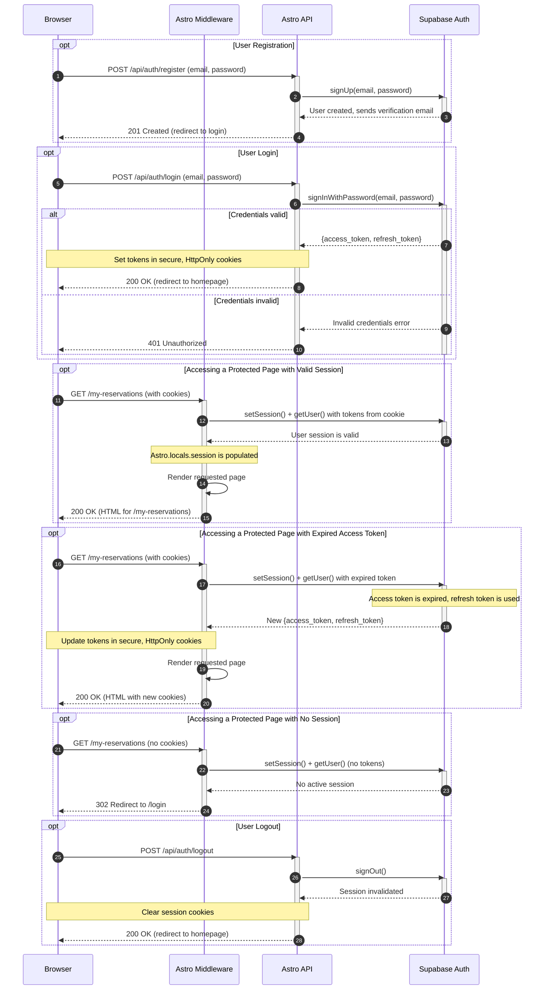

<authentication_analysis>
The authentication architecture for Reservo is designed around a Backend-for-Frontend (BFF) pattern using Astro for server-side logic and Supabase for authentication services. This analysis outlines the key flows and components based on the project's product requirements and technical specifications.

### 1. Authentication Flows

The system implements the following core authentication flows:

-   **User Registration**: New users register with an email and password. The backend API calls Supabase to create the user, and Supabase dispatches a verification email.
-   **User Login**: Registered users log in using their credentials. The API validates them against Supabase, which returns JWTs (access and refresh tokens). These tokens are then set as secure, `HttpOnly` cookies.
-   **Session Management**: For every request to the server, Astro middleware intercepts it. It uses the tokens from cookies to validate the user's session with Supabase. The session state is then attached to `Astro.locals` for use in protected pages and endpoints.
-   **Route Protection**: The middleware is responsible for protecting routes. If a user without a valid session attempts to access a protected page (e.g., `/my-reservations`), they are redirected to the `/login` page.
-   **Token Refresh**: The Supabase client library automatically handles token refreshes. When the access token expires, the middleware (via the Supabase SDK) uses the refresh token to obtain a new set of tokens from Supabase Auth. The new tokens are then set in the user's cookies.
-   **Logout**: When a user logs out, a request is sent to an API endpoint that invalidates the session in Supabase and clears the session cookies from the browser.
-   **Password Recovery**: Users can request a password reset for their email address. Supabase sends a recovery link, which directs the user to a page where they can set a new password.

### 2. Actors and Interactions

The authentication process involves four main actors:

-   **Browser**: The client application running in the user's browser. It handles user input through React forms, makes API requests, and stores session tokens in cookies.
-   **Astro Middleware**: Server-side code that runs on every request. It is the central point for session validation and route protection.
-   **Astro API**: A set of server-side endpoints (e.g., `/api/auth/login`) that act as a BFF, securely communicating with Supabase Auth on behalf of the client.
-   **Supabase Auth**: The identity provider that manages user accounts, issues and validates tokens, and handles authentication-related email communication.

### 3. Token Verification and Refresh Process

-   **Verification**: On each request, the middleware extracts the `access_token` and `refresh_token` from the browser's cookies. It uses `supabase.auth.setSession()` to establish the session context and then `supabase.auth.getUser()` to verify the access token's validity with Supabase Auth.
-   **Refresh**: If `getUser()` determines the access token is expired, the Supabase SDK automatically uses the `refresh_token` to request a new token pair from Supabase. The middleware is responsible for receiving these new tokens and setting them in the cookies to maintain the user's session.

### 4. Authentication Steps Overview

1.  **Initial Contact**: An unauthenticated user accesses the site. The middleware runs, finds no session, and allows access only to public pages.
2.  **Login**: The user submits login credentials. The browser sends them to the Astro API. The API validates with Supabase. On success, Supabase returns tokens, which the API sets as `HttpOnly` cookies and sends back to the browser.
3.  **Accessing Protected Route**: The user navigates to a protected page. The browser sends the request with the session cookies. The middleware validates the tokens with Supabase. If valid, it allows the request to proceed and renders the page. If invalid/missing, it redirects to the login page.
4.  **Logout**: The user clicks logout. The browser sends a request to the logout endpoint. The API tells Supabase to invalidate the session and clears the browser cookies.
</authentication_analysis>

<mermaid_diagram>

</mermaid_diagram>
