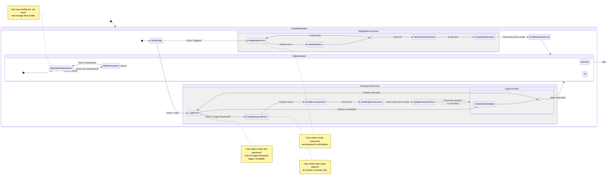

<user_journey_analysis>
1.  **User Paths Analysis**
    -   **Unregistered User:** Lands on the homepage, can see basic information but needs to register or log in to access core features. They can navigate to Login, Registration, or Forgot Password pages.
    -   **Registration:** A new user fills out a registration form. Upon submission, the system creates an account and sends a verification email. The user is then redirected to the login page with a message to check their email.
    -   **Email Verification:** The user clicks a link in the verification email, which validates their account. After verification, they are redirected to the homepage as a logged-in user.
    -   **Login:** A registered user enters their credentials. On success, they are redirected to the main dashboard/homepage, where they can access protected features. On failure, they see an error message.
    -   **Password Recovery:** A user who has forgotten their password can request a recovery link by providing their email. They receive an email and click the link to go to a page where they can set a new password.
    -   **Authenticated User:** Once logged in, the user can view facilities, make reservations, view their own reservations, and log out. Accessing protected routes is allowed.
    -   **Logout:** An authenticated user can log out, which terminates their session and redirects them to the homepage.

2.  **Main Journeys and States**
    -   **Onboarding Journey:**
        -   `[*] --> HomePage`: The starting point for any user.
        -   `HomePage`: Central hub for navigation.
        -   `RegistrationProcess`: Composite state for user sign-up.
        -   `LoginProcess`: Composite state for user sign-in.
        -   `PasswordRecoveryProcess`: Composite state for resetting a password.
    -   **Authenticated Journey:**
        -   `ApplicationDashboard`: The main view after logging in, showing facilities.
        -   `ViewMyReservations`: User views their list of bookings.
        -   `Logout`: User ends the session.

3.  **Decision Points and Alternative Paths**
    -   **Registration:**
        -   Success: Account created, email sent.
        -   Failure (e.g., user exists, invalid data): Error message shown on the form.
    -   **Login:**
        -   Success: Session created, redirected to the dashboard.
        -   Failure (invalid credentials): Error message shown on the form.
    -   **Email Verification:**
        -   Success: User is verified and logged in.
        -   Failure (invalid token): An error is implied, though not explicitly detailed in the spec for the diagram. The user would likely need to re-register or request another email.
    -   **Password Recovery:**
        -   Email Exists: Recovery email sent.
        -   Email Doesn't Exist: A generic success message is shown to prevent user enumeration.

4.  **Purpose of Each State**
    -   **HomePage:** Initial landing page for all users.
    -   **LoginForm:** Page where users enter credentials to log in.
    -   **RegistrationForm:** Page for new users to create an account.
    -   **ForgotPasswordForm:** Page for users to request a password reset.
    -   **EmailVerification:** A transient state representing the user clicking the link in their email.
    -   **UpdatePasswordForm:** Page where the user sets a new password.
    -   **ApplicationDashboard:** The main application view for authenticated users to see and book facilities.
    -   **MyReservations:** A dedicated page for users to manage their own bookings.
</user_journey_analysis>

<mermaid_diagram>

</mermaid_diagram>
