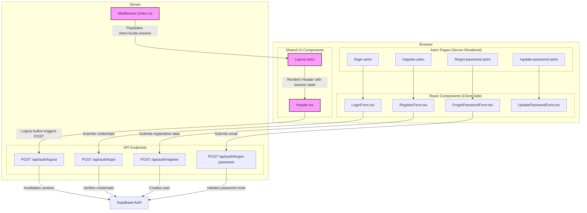

<architecture_analysis>
### 1. Components List

Based on the provided documentation, the following components and pages will be part of the authentication and user interface module:

- **Astro Pages (New):**
  - `src/pages/login.astro`: Page to host the login form. Redirects to `/` if the user is already logged in.
  - `src/pages/register.astro`: Page for user registration. Redirects to `/` if the user is logged in.
  - `src/pages/forgot-password.astro`: Page for initiating password recovery.
  - `src/pages/update-password.astro`: Page for setting a new password via a recovery link.

- **React Components (New):**
  - `src/components/auth/LoginForm.tsx`: A client-side component containing the form for user authentication.
  - `src/components/auth/RegisterForm.tsx`: A component with the user registration form.
  - `src/components/auth/ForgotPasswordForm.tsx`: A component allowing users to request a password reset.
  - `src/components/auth/UpdatePasswordForm.tsx`: A component for updating the user's password.

- **Existing Components and Layouts (To be Updated):**
  - `src/layouts/Layout.astro`: The main layout, which will be updated to handle session data from `Astro.locals` and pass it to the `Header` component.
  - `src/components/Header.tsx`: The header component, which will be modified to conditionally display "Login"/"Register" buttons or user information with a "Logout" option.

### 2. Main Pages and Their Components

The UI architecture separates static page shells (Astro) from interactive forms (React):

- **Login Page (`/login.astro`):**
  - Renders the main `Layout.astro`.
  - Embeds the `LoginForm.tsx` component.
- **Registration Page (`/register.astro`):**
  - Renders `Layout.astro`.
  - Embeds the `RegisterForm.tsx` component.
- **Forgot Password Page (`/forgot-password.astro`):**
  - Renders `Layout.astro`.
  - Embeds the `ForgotPasswordForm.tsx` component.
- **Update Password Page (`/update-password.astro`):**
  - Renders `Layout.astro`.
  - Embeds the `UpdatePasswordForm.tsx` component.

### 3. Data Flow Between Components

The data flow is designed to be unidirectional and managed through session state:

1.  **Middleware (`src/middleware/index.ts`)**: Intercepts all requests, validates session tokens from cookies, and populates `Astro.locals.session` with user data.
2.  **Layout (`Layout.astro`)**: Reads `Astro.locals.session` and passes the session state as a prop to the `Header.tsx` component.
3.  **Header (`Header.tsx`)**: Receives the session state and dynamically renders its content:
    - If **unauthenticated**, it displays "Login" and "Register" buttons that navigate to the respective pages.
    - If **authenticated**, it shows the user's email and a dropdown with a "Logout" button, which triggers a `POST` request to `/api/auth/logout`.
4.  **Auth Forms (e.g., `LoginForm.tsx`)**: These components manage their own internal form state. Upon submission, they send `POST` requests with user credentials to the relevant backend API endpoints (e.g., `/api/auth/login`).

### 4. Component Functionality Description

- **`Layout.astro`**: Acts as the primary page wrapper, integrating the session state from the server-side middleware into the client-side UI via the `Header` component.
- **`Header.tsx`**: Serves as the main navigation bar and entry point for all authentication-related actions, adapting its appearance based on the user's session status. This component requires updates to handle the new authentication state.
- **Auth Forms (`LoginForm`, `RegisterForm`, etc.)**: Encapsulate all logic related to user input, client-side validation, and API communication for their specific authentication task. They are responsible for displaying validation errors or success messages.
- **Astro Auth Pages (`login.astro`, `register.astro`, etc.)**: Serve as static containers for the dynamic React form components, providing the necessary routing and server-side logic (like redirects for authenticated users).
</architecture_analysis>

<mermaid_diagram>

</mermaid_diagram>
